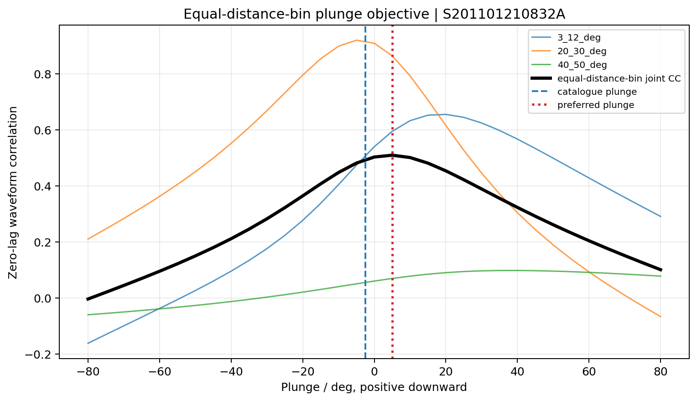
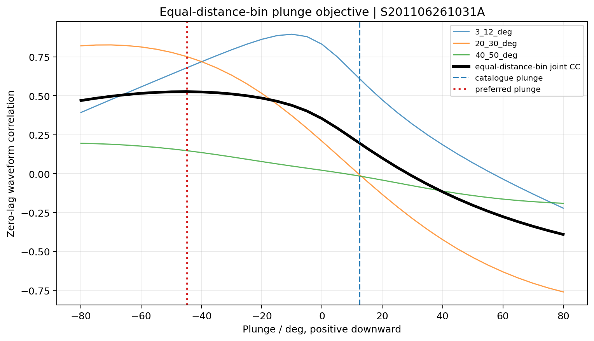
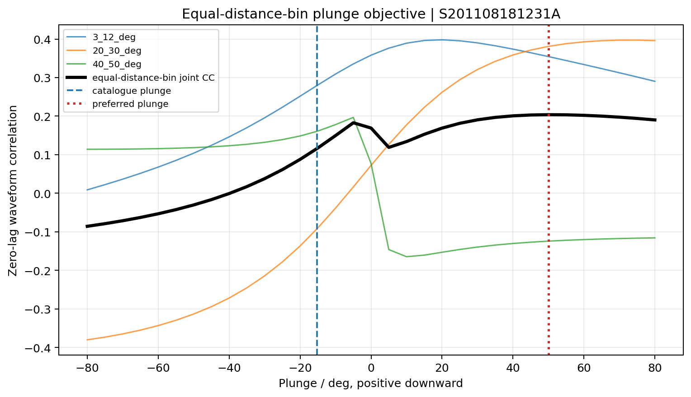
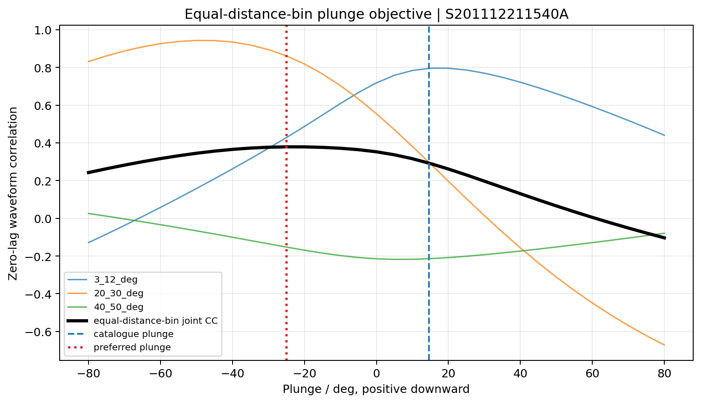

# Preferred-plunge sensitivity results

This repository contains a compact summary of the preferred-plunge sensitivity analysis for four glacial-earthquake events: event indices 0, 1, 3, and 4.

## Files

- [Excel results](four_event_plunge_results.xlsx)
- [Event summary table](event_summary.csv)
- [Selected-station QC table](selected_stations.csv)

## Analysis settings

- Component: Z
- Frequency band: 1/150–1/50 Hz (50–150 s)
- Distance bins: 3–12°, 20–30°, and 40–50°
- Data coverage: ≥ 0.95
- Z-component SNR: ≥ 2
- MUSTANG noise threshold: within 15 dB of the quietest candidate in each distance bin
- Radiation-energy threshold: ≥ 20% of the maximum azimuthal energy
- Primary metric: zero-lag waveform cross-correlation
- Secondary diagnostic: normalized RMS
- Robustness test: leave-one-station-out analysis

## Joint cross-correlation results

### Event 0

### Event 1

### Event 3

### Event 4

Event 2 is not included because its EarthScope Syngine request did not complete.
